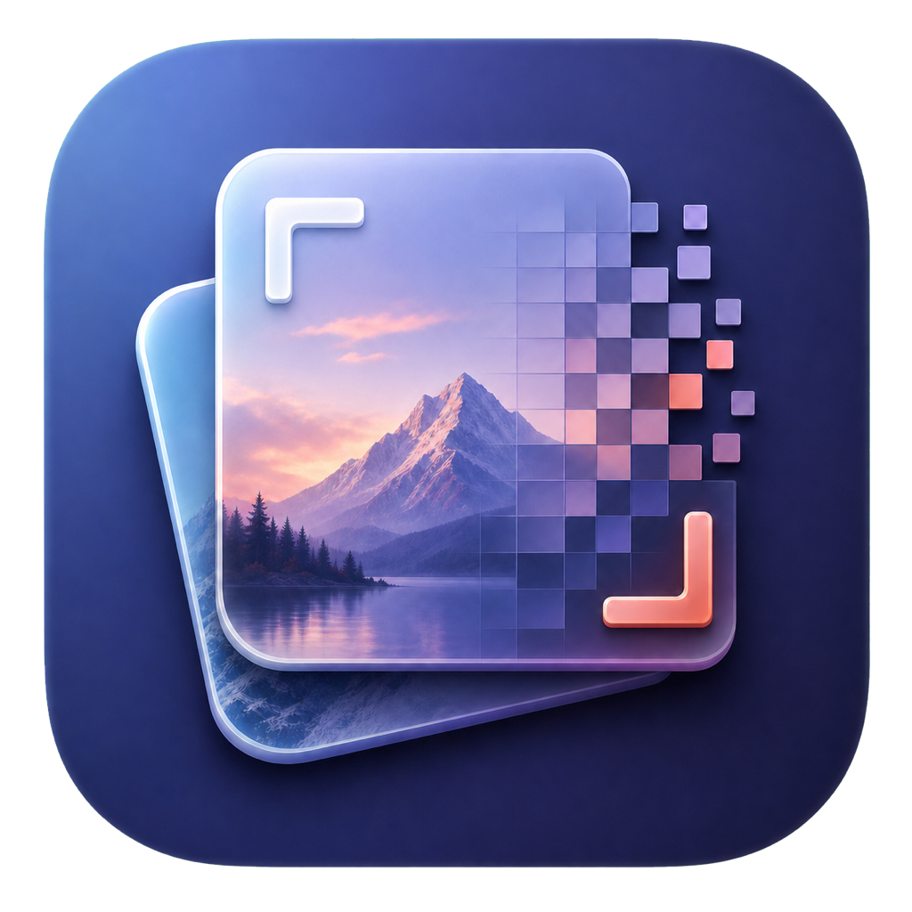
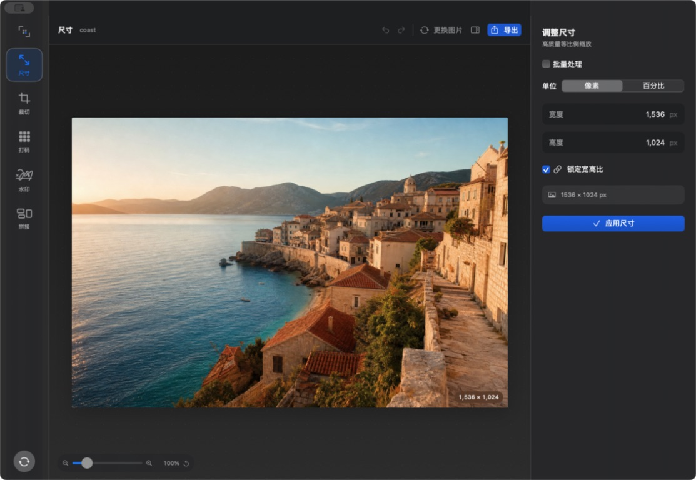
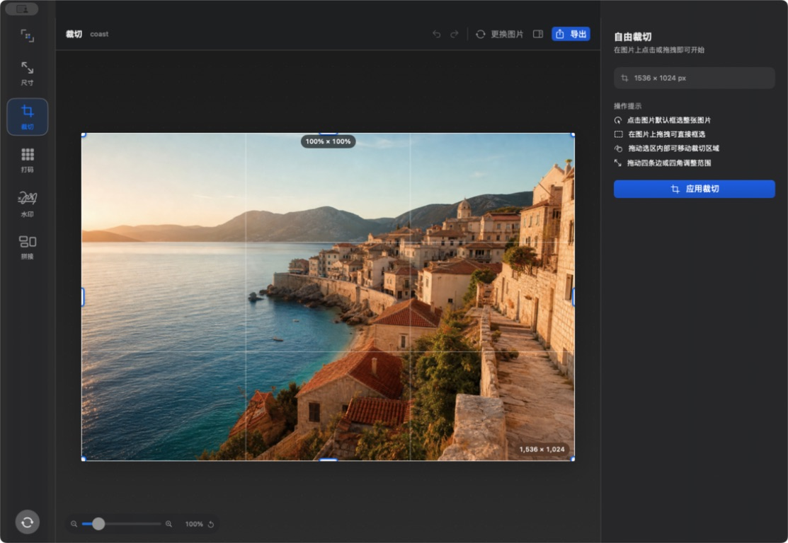
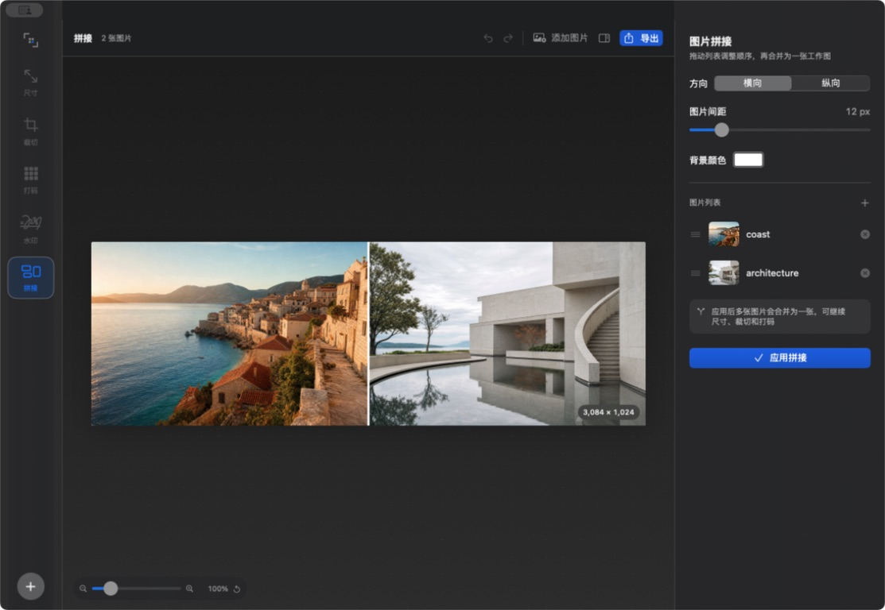

<p align="center">
  
</p>

<h1 align="center">MosaicLite</h1>

<p align="center">
  一款轻量、原生、专注常用操作的 macOS 图片编辑工具。
</p>

MosaicLite 使用 SwiftUI、AppKit、Core Graphics 与 Core Image 构建。图片处理全部在本机完成，不上传图片，也不依赖网络服务。

## 界面预览

<p align="center">
  
</p>

<table>
  <tr>
    <td width="50%">
      
    </td>
    <td width="50%">
      
    </td>
  </tr>
  <tr>
    <td align="center">拖动边缘与四角自由裁切</td>
    <td align="center">横向、纵向拼接与拖拽排序</td>
  </tr>
</table>

## 功能

- 按像素或百分比等比例调整尺寸
- 尺寸调整和水印的多图批量处理
- 拖动边缘与角点进行自由裁切
- 框选或手涂打码
- 像素、晶格、柔和模糊三种马赛克风格
- 横向或纵向拼接，支持间距、背景色和拖拽排序
- 满图文字水印与自定义 PNG Logo 水印
- 画布滚轮缩放和固定缩放滑块
- 撤销、重做、实时预览及 PNG/JPEG 导出
- 浅色与深色模式

## 系统要求

- macOS 15 或更高版本
- Xcode 16 或更高版本（从源码构建）

## 从源码运行

克隆项目后，使用 Xcode 打开根目录的 `Package.swift`，选择 `MosaicLite` Scheme 后运行。

也可以在终端构建应用：

```bash
./scripts/build-app.sh
open outputs/MosaicLite.app
```

脚本会生成使用本地临时签名的 `outputs/MosaicLite.app`。首次直接打开本地构建版本时，macOS 可能显示来源提示。

## 测试

```bash
swift test
```

测试覆盖尺寸调整、裁切、拼接、批量处理、水印和马赛克等核心图片处理能力。

## 项目结构

```text
Sources/MosaicLite/
├── MosaicLiteApp.swift    应用入口和菜单命令
├── ContentView.swift      主框架、功能栏和顶部工具栏
├── EditorCanvas.swift     图片画布、裁切和打码手势
├── InspectorPanel.swift   各类编辑功能的参数面板
├── EditorModel.swift      编辑状态、历史记录和导入导出
├── ImageProcessor.swift   Core Graphics / Core Image 处理核心
└── Models.swift           工具及参数模型
```

## 参与贡献

欢迎提交 Issue 和 Pull Request。开始前请阅读 [CONTRIBUTING.md](CONTRIBUTING.md)。

## 许可证

MosaicLite 基于 [MIT License](LICENSE) 开源。
